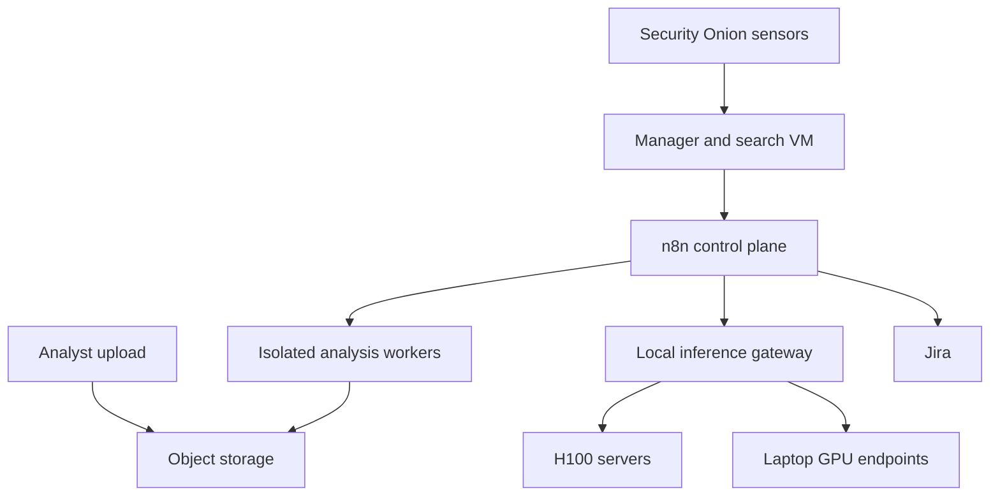

# POC architecture

## Goals

The POC tests whether remote evidence acquisition plus automated, evidence-cited triage can reduce on-site analyst deployments without weakening chain of custody or analyst control.

It intentionally separates orchestration, hostile-evidence processing, model inference, and case management.

## Placement

Security Onion and n8n may share an ESXi or Proxmox host for a POC, but they should not share a guest. Search, workflow, and forensic processing workloads have independent failure modes and bursty resource requirements.

Recommended guests:

1. Security Onion manager/search.
2. n8n, PostgreSQL, and Redis.
3. S3-compatible evidence storage, unless an existing storage service is available.
4. Disposable network and host analysis workers.
5. Local inference gateway and GPU runtimes.

## Trust boundaries

| Zone | Permitted connections | Prohibited behavior |
|---|---|---|
| n8n control plane | PostgreSQL, Redis, adapters, model gateway, Jira | Direct mounting or parsing of evidence |
| Evidence storage | TLS object operations from approved services | Public access and unaudited deletion |
| Analysis workers | Job API, evidence read, derivative write | General internet access and writable source mounts |
| Model network | Normalized text/JSON from n8n | Raw evidence access and arbitrary tools |
| Security Onion | Manager-supported search and PCAP interfaces | Unmanaged agents installed on sensors |

## Network investigation sequence

1. n8n receives or polls a Zeek or Suricata event.
2. The adapter normalizes the event and calculates an idempotency key.
3. Rule-based eligibility decides whether PCAP is justified.
4. A bounded PCAP carve is requested through the Security Onion-facing adapter.
5. The worker hashes and stores the original carve and its evidence manifest.
6. Deterministic tools produce Zeek, Suricata, and packet summaries.
7. Role-specific models analyze only normalized results.
8. A skeptic pass challenges the conclusion.
9. Schema and citation validation reject unsupported findings.
10. Jira receives the report and evidence references.

Default POC carve policy:

- Prefer Community ID or five-tuple selection.
- Start at alert time minus 120 seconds and end at plus 300 seconds.
- Require approval above 250 MB.
- Never silently widen a carve when no matching packets are returned.

## Host investigation sequence

1. n8n creates an intake record and a presigned upload destination.
2. The analyst uploads directly to object storage.
3. A worker validates format, calculates SHA-256, and compares the acquisition manifest.
4. The image is attached read-only and never booted.
5. Deterministic parsers produce normalized artifact sets and timelines.
6. Persistence, execution, identity, network, malware, and timeline roles run independently.
7. A custom-hunt role processes analyst-defined questions.
8. The skeptic and consensus stages expose conflicts and collection gaps.
9. Jira receives the final report; raw images remain in evidence storage.

A static disk image can support configured-service and historical-execution analysis. It cannot establish a reliable acquisition-time process list. That requires a memory image, live response, or endpoint telemetry.

## Agent contract

Agents are versioned sub-workflows, not autonomous services installed on sensors. They receive bounded normalized data and produce `schemas/finding.schema.json` output.

Agents may:

- classify evidence;
- correlate deterministic records;
- propose alternative explanations;
- identify collection gaps; and
- recommend analyst actions.

Agents may not:

- invoke arbitrary commands;
- alter source evidence;
- access the public internet;
- contain endpoints;
- block indicators; or
- close Jira investigations during the POC.

## Model routing

Expose local runtimes through a single OpenAI-compatible gateway. Route using logical profiles rather than hard-coded model names:

| Profile | Workload |
|---|---|
| `triage-small` | Normalization and low-context classification |
| `network-medium` | Zeek and packet summaries |
| `host-medium` | Individual artifact families |
| `synthesis-large` | Cross-agent correlation and report generation |
| `review-large` | Contradiction and unsupported-claim review |

Laptop endpoints are optional development capacity. Production-like POC runs should prefer the managed H100 pool so concurrency, logs, and model versions are reproducible.

## POC gates

1. Read-only evidence processing and report-only Jira output.
2. Analyst disposition required for every investigation.
3. Compare automation output with blind human review.
4. Enable narrowly defined benign auto-closure only after measured validation.
5. Keep containment outside this system until a separate authorization and rollback design exists.

## Success metrics

- percentage of cases resolved without an on-site visit;
- analyst minutes per case;
- alert-to-preliminary-report latency;
- PCAP carve and parser success rates;
- findings with valid evidence citations;
- false-positive and false-negative rates;
- requests for additional collection;
- provenance or hash validation failures;
- model disagreement rate; and
- GPU time per completed investigation.

